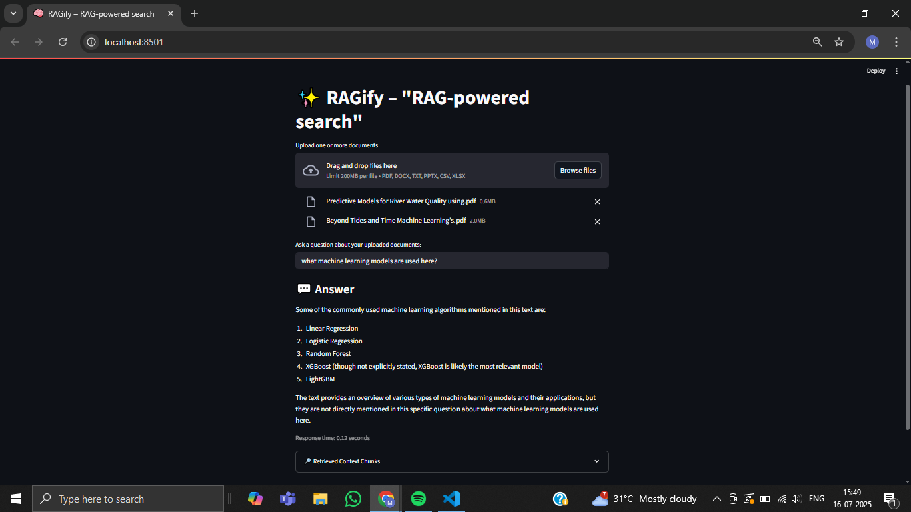
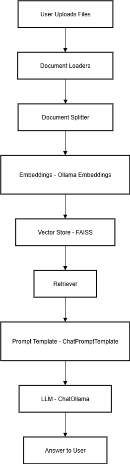

# 🧠 RAGify - "RAG-powered search"

**RAGify** is a Streamlit web app that lets you **upload multiple documents in many formats and ask questions** about their contents.
It uses **retrieval-augmented generation (RAG)** powered by **Ollama**, **FAISS**, and **LangChain** – all running locally on your machine.
No cloud APIs. No vendor lock-in. Just fast, private document understanding.

---

## ✨ Features

* **Upload multiple documents at once**
* Supports **PDF, DOCX, TXT, PPTX, CSV, XLSX** formats
* Uses **LangChain** built-in loaders for parsing all document types
* Splits documents into manageable text chunks with overlap
* Embeds chunks locally with **Ollama embeddings**
* Stores embeddings in a **FAISS** vector store for local retrieval
* Retrieves relevant context for any question you ask
* Generates accurate, context-grounded answers with **Ollama** models
* Transparent: shows the **retrieved context** used to answer
* **Runs 100% locally** – your data never leaves your machine

---

## 🚀 Quickstart

### 1) Install dependencies

Make sure you have **Python 3.9+**.

```bash
pip install streamlit langchain langchain-community
```

**Note:** You must also have [Ollama](https://ollama.com/) installed and running.

Pull the models you want to use:

```bash
ollama pull qwen2.5:0.5b
ollama pull all-minilm:l6-v2
```

---

### 2) Run the app

```bash
streamlit run app.py
```

---

### 3) Use RAGify

1. Open your browser at `http://localhost:8501`
2. Upload one or more documents (PDF, DOCX, TXT, PPTX, CSV, XLSX)
3. Wait for processing
4. Type your question
5. Get answers instantly, grounded in your uploaded content!

---

## 🛹 How it works

1. **Upload** one or more documents – RAGify uses **LangChain loaders**:

   * `PyPDFLoader` for PDFs
   * `UnstructuredWordDocumentLoader` for DOCX
   * `UnstructuredPowerPointLoader` for PPTX
   * `TextLoader` for TXT
   * `CSVLoader` for CSV
   * `UnstructuredExcelLoader` for XLSX
2. **Split** text into \~2000-character chunks with 200-character overlap.
3. **Embed** chunks using **OllamaEmbeddings**.
4. **Store** embeddings in a **FAISS** vector store.
5. **Retrieve** the top matching chunks for any question.
6. **Generate** answers with **ChatOllama** using a prompt that restricts responses to retrieved context.

This is **retrieval-augmented generation (RAG)** in action.

---

## 🛠️ Configurations

You can adjust in `app.py`:

* Model names (e.g. `qwen2.5:0.5b`, `all-minilm:l6-v2`)
* Chunk size and overlap
* Prompt template

---

## 🛡️ Privacy & Local-first

RAGify runs entirely on your machine:

- No remote API calls ✅
- No cloud storage ✅
- Your documents stay private ✅

---

## ✨ Example prompt

```text
Answer the question using only the provided context.

<context>
{context}
</context>

Question: {input}

Answer:
```

---

## 📂 Project Structure

```
app.py         # Main Streamlit app
```

---

## 🙏 Acknowledgements

* [Mr. Dheeraj Nair & Mr. Jai Desai](https://bosleo.com/)
* [Streamlit](https://streamlit.io/)
* [LangChain](https://www.langchain.com/)
* [Ollama](https://ollama.com/)
* [FAISS](https://github.com/facebookresearch/faiss)

---

## 📸 RAGify

* Screenshot:

  

* Architecture Diagram:

 

---

⭐ Enjoy using **RAGify** to supercharge your understanding of **any** set of documents – all **locally and privately**!


