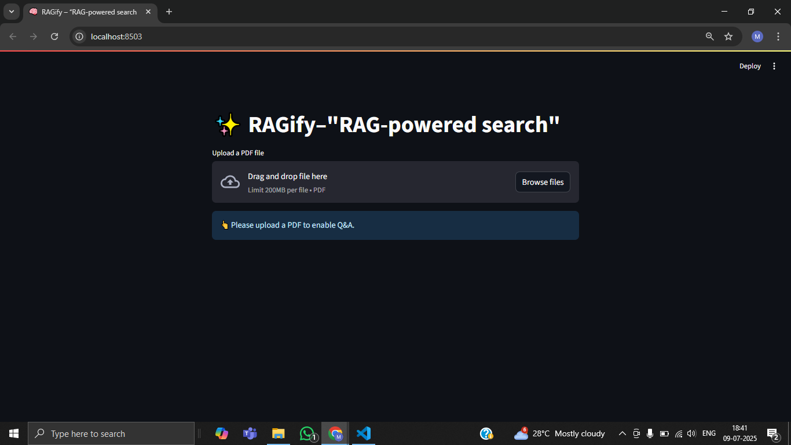
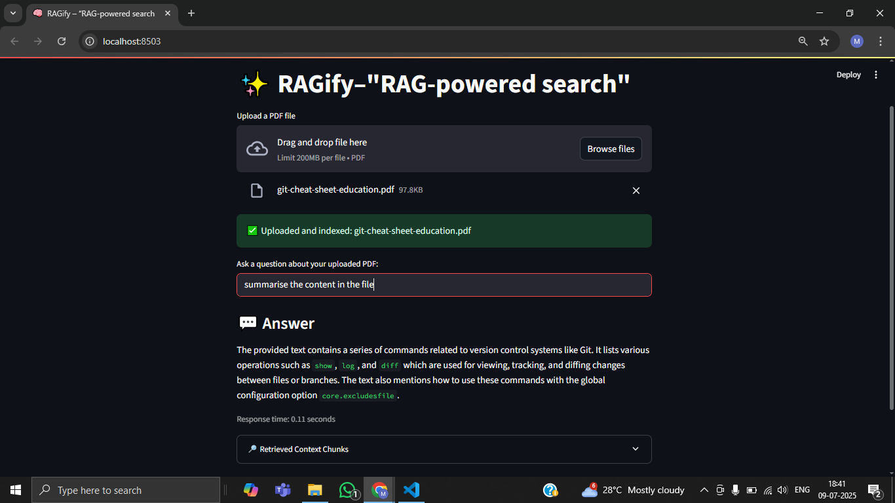

# 🧠 RAGify - "RAG-powered search"

**RAGify** is a Streamlit web app that lets you **upload any PDF and ask questions** about its contents.
It uses **retrieval-augmented generation (RAG)** powered by **Ollama**, **FAISS**, and **LangChain** – all running locally on your machine.
No cloud APIs. No vendor lock-in. Just fast, private document understanding.

---

## ✨ Features

- Upload and process PDF documents
- Split documents into manageable text chunks
- Embed chunks locally with Ollama embeddings
- Store embeddings in FAISS vector store
- Retrieve relevant context for any question
- Generate accurate, context-grounded answers with Ollama models
- Transparent: see retrieved context used to answer

---

## 🚀 Quickstart

### 1) Install dependencies

Make sure you have Python 3.9+.

```bash
pip install streamlit langchain langchain-community
```

**Note:** You must also have [Ollama](https://ollama.com/) installed and running.

For example, to pull a model:

```bash
ollama pull qwen2.5:0.5b
```

And for embeddings:

```bash
ollama pull all-minilm:l6-v2
```

---

### 2) Run the app

```bash
streamlit run app.py
```

---

### 3) Use RAGify

1. Open your browser at `http://localhost:8501`
2. Upload a PDF
3. Wait for processing
4. Type your question
5. Get answers instantly!

---

## 🧹 How it works

1. **Upload** a PDF – RAGify loads it with `PyPDFLoader`.
2. **Split** text into chunks (2000 characters with 200 overlap).
3. **Embed** chunks using `OllamaEmbeddings`.
4. **Store** embeddings in a FAISS vector store.
5. **Retrieve** top-matching chunks for any question.
6. **Generate** answers with `ChatOllama` using a prompt that restricts answers to retrieved context.

This is **retrieval-augmented generation (RAG)**.

---

## 🛠️ Configurations

You can adjust in `app.py`:

* **Model names** (`qwen2.5:0.5b`, `all-minilm:l6-v2`)
* **Chunk size and overlap**
* **Prompt template**

---

## 🛡️ Privacy & Local-first

Ragify runs entirely on your machine:

* No remote calls
* No cloud storage
* Your documents never leave your computer

---

## ✨ Example prompt

```text
Answer the question using only the provided context.

<context>
{context}
</context>

Question: {input}

Answer:
```

---

## 📂 Project Structure

```
app.py         # Main Streamlit app
```

---

## 🙏 Acknowledgements

* [Streamlit](https://streamlit.io/)
* [LangChain](https://www.langchain.com/)
* [Ollama](https://ollama.com/)
* [FAISS](https://github.com/facebookresearch/faiss)

---





⭐ Enjoy using **RAGify** to supercharge your document understanding!
